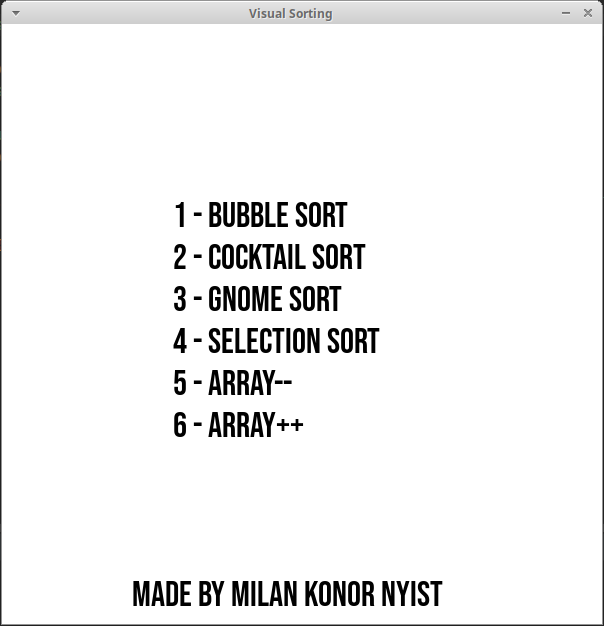
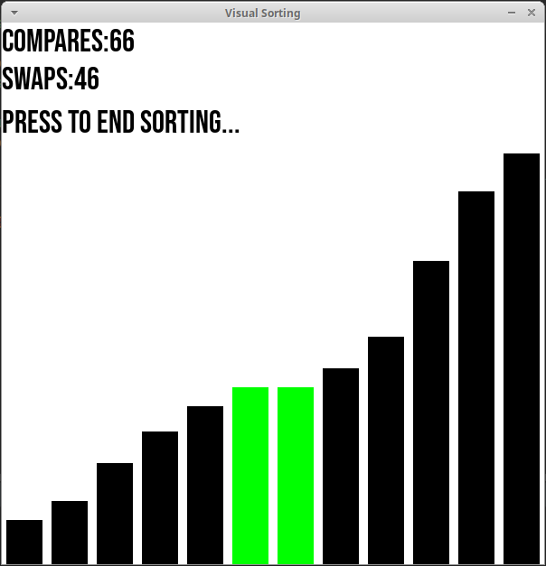

# Sorter-Visualisation

C++ project based on the famous youtube video [15 Sorting Algorithms in 6 Minutes](https://www.youtube.com/watch?v=kPRA0W1kECg).

## Usage

```bash
git clone https://github.com/NyistMilan/Sorter-Visualisation.git

cd Sorter-Visualisation

cmake .

make
```

## Pictures



